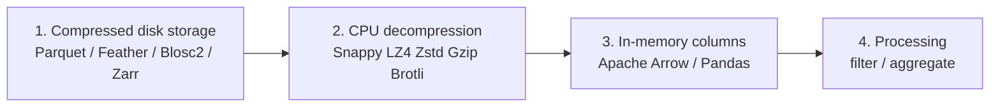

# Data path — compressed disk → CPU decompress → in-memory processing

## Step-by-step

### 1. Compressed disk storage
Dataset is written with a chosen columnar format and codec. Smaller files mean fewer bytes cross the disk bus (helps when the machine is **disk I/O bound**).

### 2. CPU decompression
On read, the codec expands blocks back to plain values. Heavier codecs (gzip, high zstd, brotli) shrink more but burn more CPU (risk of a **CPU bottleneck**).

### 3. In-memory processing
Decoded columns live in Arrow/Pandas. Columnar layout lets analytics touch only needed columns — less RAM traffic than row-oriented CSV.

### 4. Optional branch — compress-then-cache
Keep a Blosc2/Zstd blob in RAM and decompress on access. Trades CPU for a smaller cache footprint when memory is tighter than compute.

## ផ្លូវទិន្នន័យ (ខ្មែរ)

1. **ថាសដែលបង្ហាប់** — រក្សាទុកជា Parquet/Blosc2  
2. **CPU រំសាយបង្ហាប់** — decode មុនប្រើ  
3. **ក្នុង RAM** — ជួរឈរ (columns) សម្រាប់គណនា  
4. **ដំណើរការ** — filter / aggregate  
